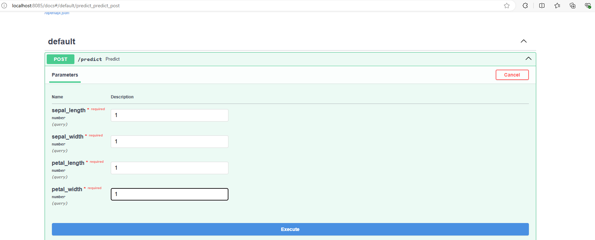

# Iris dataset 

By launching this app you create and train a simple model that predicts iris type. Model is only created once at the app initialization. This model is running locally and could potentially be tracked by mlflow (not impemented). This app has one API method "predict" that takes 4 values and returns a dictionary {'prediction': iris_type}
.

## Environment 
The docker file and requirements.txt are attached. 
```
pip install -r requirements.txt
```
In this case you also need to set env variables (below are values from dockerfile) 

For Windows
```
set SERVER_PORT=8080
set MODEL_PORT=8081
```
For Linux
```
export SERVER_PORT=8080
export MODEL_PORT=8081
```

\
If you use docker you can build from the dockerfile
```
docker build -t <your_image_name> <path/to/glowbyte_test>
```

or use my docker image https://hub.docker.com/r/artemjds/glowbyte_testcase.


## Functionality

The app implements one method that gets 4 floats and returns predicted iris type.

You can use uvicorn to run the app and access it in your browser (http://localhost:_your_port) (8085 in my example).
```
uvicorn app.main:app --host 0.0.0.0 --port 8085
```
\
You can also use docker run.
```
docker run -d --name your_container_name -p 8085:8085 glowbyte_testcase 
```
After that in your browser you will see the following




Amen